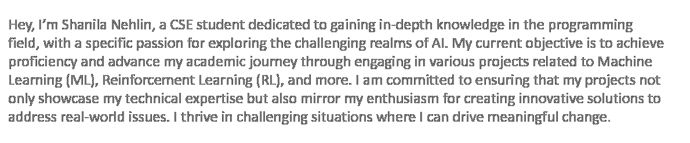

 

 
SKILLS :mortar_board: 

<table>
 <td>
  
<td>

   Languages & Backend Development :
    
    
    
    
    
    
  
   Frontend Development :
    
    
    
    
    
    
    
   Framework & Database :
    
    
    
    
    
    
   Softwares :
    
    
    
    
    
    

</td>
</table>

  

  
PROJECTS :closed_book: 

| Project | Description |
| --- | --- |
| <h2 align="center"><a href="https://github.com/nehlinshanila/BulletDodge-Reinforcement-Learning-Model--CSE465">Bullet Dodge: Env To Test The Impact Of Different Neural Architectures </a></h2> | 
Reinforcement learning agent in a challenging arena, exploring the influence of environmental factors and neural network architectures on optimal learning strategies in dynamic scenarios.
 |
| <h2 align="center"><a href="https://github.com/nehlinshanila/Y-ALO-AI-Tracker">Y-ALO: AI Infused Dynamic Menstrual Cycle Tracking System</a></h2> | 
Menstrual health & tracking app with AI integrated chatbots aiding rural women with cycle monitoring, notifications, appointments, personalized generated advice, Bengali language support, fostering healthier lives.
 |
| <h2 align="center"><a href="https://github.com/nehlinshanila/Epicity">Epicity.pen: Doodling just got epic </a></h2> | 
 Application that transforms ordinary doodles into realistic vibrant images.
 |
| <h2 align="center"><a href="https://github.com/nehlinshanila/Digital-Hearing-Aid--CSE299">Digital Hearing Aid</a></h2> | 
App for people with hearing aid disability and autism that takes input sound and then processes, suppresses extreme loud sudden sounds, and finally amplifies the output according to the user’s need.
 |
| <h2 align="center"><a href="https://github.com/nehlinshanila/Learning-Disorder-Minors-ASD--CSE445">Prediction of Learning Disorder Rate in Children on the autism spectrum</a></h2> | 
Machine Learning model to accurately predict learning disorders in children on the autism spectrum using the ASD dataset through multiple algorithms, cross validation techniques and XAI
 |
| <h2 align="center"><a href="https://github.com/nehlinshanila/Synchronization-Software--CSE327">Synchronization Software</a></h2> | 
A user-friendly software application that allows users to synchronize and share any kind of data across multiple devices and operating systems for increased productivity and efficiency.
 |
| <h2 align="center"><a href="https://github.com/nehlinshanila/Activity-Selection-Problem--CSE373">Activity Selection Problem</a></h2> | 
Implementation of the Activity Selection Problem using the Merge Sort algorithm with greedy approach while selecting a maximum number of non-overlapping activities from a given random array generated activities with their own start time and an end time.
 |
| <h2 align="center"><a href="https://github.com/nehlinshanila/Blood-Donation-Management-System--CSE311">Blood Donation Management System</a></h2> | 
Web-based system that helps the users with the information of different blood types and how they can be utilized in the blood bank to help several clients that are in need.
 |

  

  
FIND ME :computer: 

 

 

